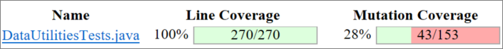
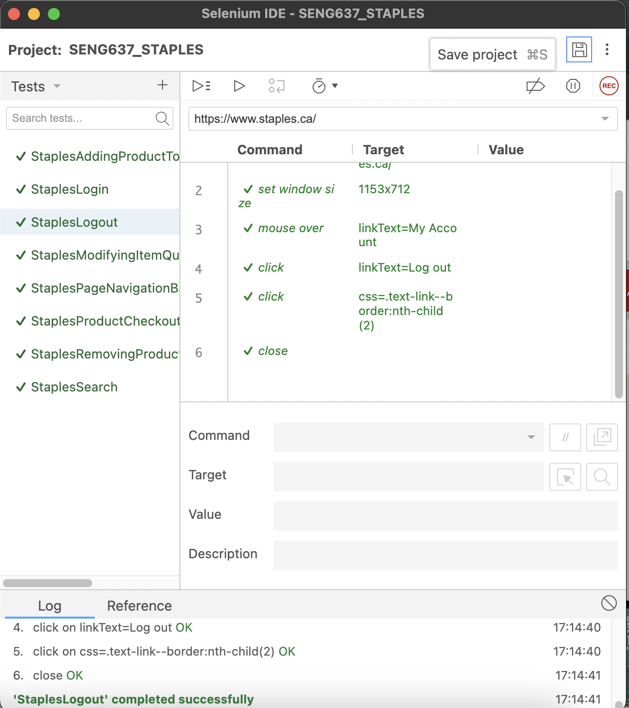
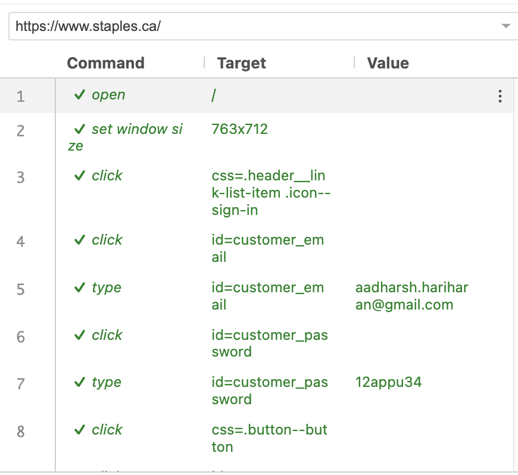
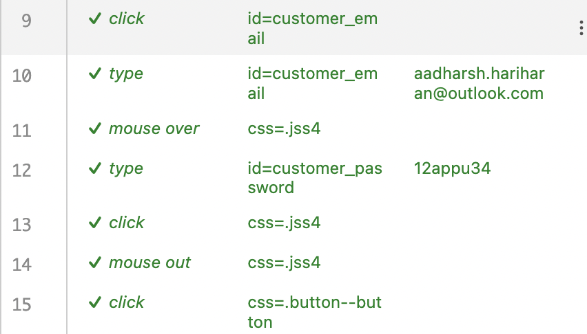
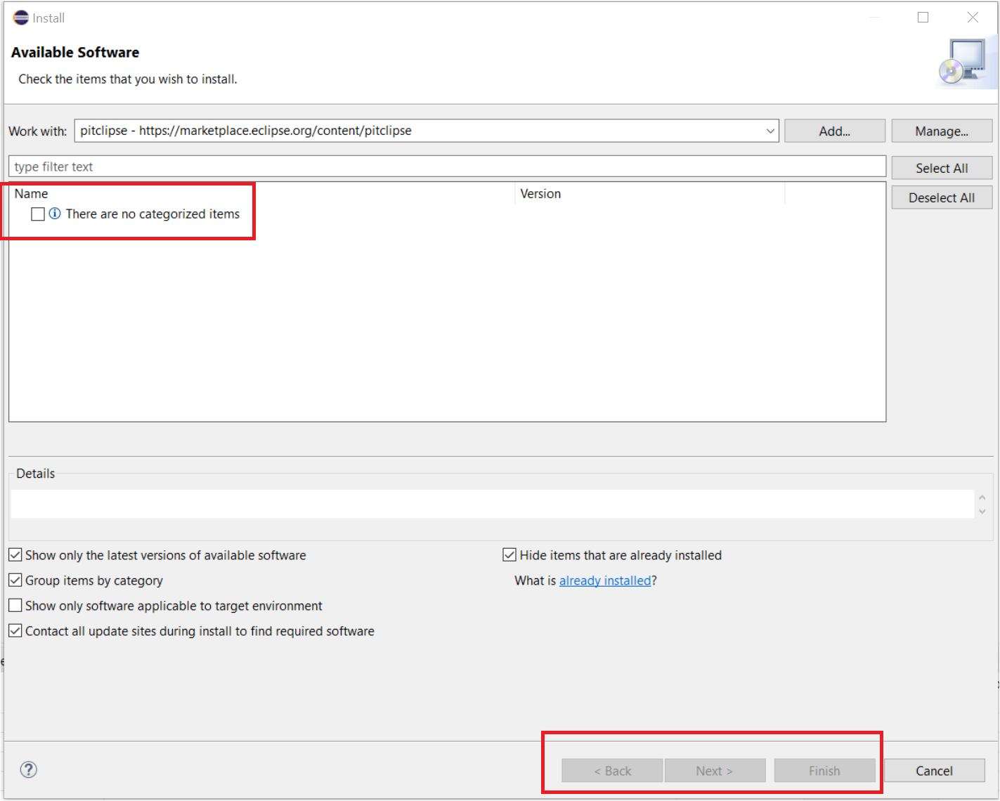
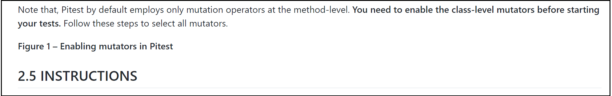
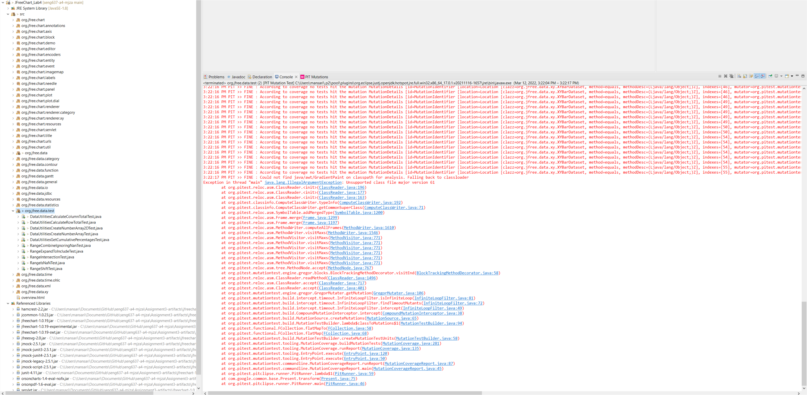

**SENG 637- Dependability and Reliability of Software Systems**

**Lab. Report \#4 – Mutation Testing and Web app testing**

| Group \#:       |              4              |
|-----------------|-----------------------------|
| Student Names:  |  1. Mahdi Jaberzadeh Ansari |
|                 |  2. Aadharsh Hariharan      |
|                 |  3. Shirin Yamani           |
|                 |  4. Rahul Ravi              |

# Introduction

This lab covers 2 core concepts of testing; 

**1) Mutation Testing:** A test methodology that is used to validate how well a test suite is designed, and whether it has any weaknesses. This is done by introducing mutants, these being modified code that add bugs in order to test if your current test suite, kills these mutants or not. In this lab we will use the test suite in lab 3 to test mutation testing using Pitest. We will evaluate our test suite and aim to improve it by 10% for each test class.

**2) GUI and Web Testing:** The second part of this lab focuses on GUI and web testing. Given the popularity of websites and GUI the concepts of automating web and GUI testing are very important. To demonstrate the concepts of GUI testing the Selenium plugin was implemented to design our test cases. These automated test cases were executed and the results reported. Additionally, we compared Selenium to another tool, Sikulix.

# Link of demo video 

[Here](./Demo.mp4) is the link to our demo video. 

# Analysis of 10 Mutants of the Range class 

## Mutant 1
Class name: RangeTests

Method name: setUpBeforeClass

Mutant killed: No

Mutation: removed call to java/io/PrintStream::println

Analysis: PIT removed the `System.out.println` function as it is a void function. As this is only a messaging function, does not cause to any failing in execution. Therefore, the mutant is not possible to be killed and the mutant is an equivalent mutation. 

## Mutant 2
Class name: RangeTests

Method name: bothRangesNaN

Mutant killed: Yes

Mutation: negated conditional

Analysis: The if statement `if(result != null)` has been changed to `if(result == null)`, therefore, as the result must be null, then the result of the expression is true and the next `fail` function will be executed. Then the mutant is killed. 

## Mutant 3
Class name: RangeTests

Method name: lowerBoundNaN

Mutant killed: Yes

Mutation: negated conditional

Analysis: The if statement `if(Double.isNaN(result.getLowerBound()) == false)` has been changed to `if(Double.isNaN(result.getLowerBound()) != false) `, therefore, as the result of the expression is true, the next `fail` function will be executed. Then the mutant is killed. 

## Mutant 4
Class name: RangeTests

Method name: rangeLowerBoundIntersectionShouldBeTrue

Mutant killed: No

Mutation: remove call to org/junit/Assert::assertTrue

Analysis: PIT removed the `assertTrue("The lower bound of new range intersects with example range, hence value should be true", exampleRange2.intersects(0, 2));` function as it is a void function. As this is the only statement of the `rangeLowerBoundIntersectionShouldBeTrue` function and does not return any value, removing of it does not cause to any failing in execution. Therefore, the mutant is not possible to be killed in this case and the mutant is an equivalent mutation.

## Mutant 5
Class name: RangeTests

Method name: rangeIntersectionShouldBeFalse1

Mutant killed: No

Mutation: remove call to org/junit/Assert::assertFalse

Analysis: PIT removed the `assertFalse("The ranges do not intersect, hence value should be false", exampleRange2.intersects(3, 4));` function as it is a void function. As this is the only statement of the `rangeIntersectionShouldBeFalse1` function and does not return any value, removing of it does not cause to any failing in execution. Therefore, the mutant is not possible to be killed in this case and the mutant is an equivalent mutation.

## Mutant 6
Class name: RangeTests

Method name: upperBoundNaN

Mutant killed: Yes

Mutation: negated conditional

Analysis: The if statement `if(result.getLowerBound() != 2)` has been changed to `if(result.getLowerBound() == 2)`, therefore, as the result of the expression is true, the next `fail` function will be executed. Then the mutant is killed. 

## Mutant 7
Class name: RangeTests

Method name: shiftTowardsPositiveScaleByCrossingZero

Mutant killed: Yes

Mutation: negated conditional

Analysis: The if statement `if (range.getUpperBound() != 3)` has been changed to `if (range.getUpperBound() == 3)`, therefore, as the result of the expression is true, the next `fail` function will be executed. Then the mutant is killed.

## Mutant 8
Class name: RangeTests

Method name: expandedRangeIncludingTwo

Mutant killed: Yes

Mutation: remove call to org/junit/Assert::assertEquals

Analysis:  PIT removed the `assertEquals("The range -1 and 1 should be -1 and 2 when including 2", Range.expandToInclude(exampleRange, posNewValue), expectedRangeWithPosVal);` function as it is a void function. As this is the only statement of the `expandedRangeIncludingTwo` function and does not return any value, removing of it, does not cause to any failing in execution. Therefore, the mutant is not possible to be killed in this case and the mutant is an equivalent mutation.

## Mutant 9
Class name: RangeTests

Method name: upperBoundNaN

Mutant killed: Yes

Mutation: negated conditional

Analysis: The if statement `if(!Double.isNaN(result.getUpperBound()))` has been changed to `if(Double.isNaN(result.getUpperBound()))`, therefore, as the result of the expression is true, the next `fail` function will be executed. Then the mutant is killed.

## Mutant 10
Class name: RangeTests

Method name: shiftValueIsZero

Mutant killed: Yes

Mutation: negated conditional

Analysis: The if statement `if(range.getLowerBound() != -1)` has been changed to `if(range.getLowerBound() == -1)`, therefore, as the result of the expression is true, the next `fail` function will be executed. Then the mutant is killed.

# Report all the statistics and the mutation score for each test class

## DataUtilities

After addition of new test cases, mutation coverage was increased to 33%. The focus of the new test cases were to cover and find mutants that survived. For example, we haven't used `assertArrayEquals` in the previous assignment, but this time we tried to use it and reduce the number of execution of void methods to increase the percentage.

## Range

After addition of new test cases for the Range test class, mutation coverage was increased to 25%. The focus of the new test cases were methods of Range not covered in the original test suite, plus adding IF statements and `fail` method instead of using simple `assertEquals` function, to be able to mutate by PIT.

# Analysis drawn on the effectiveness of each of the test classes

## DataUtilities Test Suite:

Overall this test suite generally works effectively based on the high coverage and mutant coverage scores. It is important to note that they are likely equivalent mutants present which will be inflating the score.

## Range Test Suite

Even after the addition of the new test cases, mutation coverage remains low at 25%. The biggest problem in our test cases for Range class was that must of them just contain a simple `assertEquals` function and as it is a void function, PIT tries to remove it and then the mutant can survive. To kill these kinds of mutants we needed to change the strategy and instead of having a simple void function call, have some logic to kill the mutants.   

# A discussion on the effect of equivalent mutants on mutation score accuracy

Equivalent mutants are mutants and they do not affect the functionality of the software which means that it does not make any difference in comparison with the original code. The reason of this is such a great number of these mutants will give a misleading mutation score. This outcome is due to the fact that any test case that passes on the original software will also pass with the equivalent mutant implemented.

The problem with the presence of these equivalent mutants is that they will inflate the mutation score. In other words, if a large number of equivalent mutants exist, then consequently mutation score will be very high regardless of how robust and well designed the test suite is.

The equivalent mutant problem can be solved using distinguishability of test cases. In order to differentiate a mutant from the program, the test suite behavior has to provide implications of difference which can be obtained as a byproduct of determining distinguishable testcases. This achieves fault localization in a much simpler way. Constraints are introduced in order to observe behavioral aspect of programs. Also, not all test cases are distinguishable hence it is important to make sure that they are feasible, meaning there is a valid output for all inputs through execution of the program and its mutant. 

The algorithm that we identified to be the best for equivalent mutant detection would involve representing the program and its mutant as constraints over a set of fixed nesting depths through iterations that terminates once the maximum depth is reached. This helps with behavioral execution. Over each step, identical input variable are considered where '_m_' is postfixes at the end of mutant's variables. The test cases are then applied over them separately to obtain corresponding sets of output variables for comparison. A constraint solver generates a solution that maps all variables satisfying the constraint set for comparison, that for all output variables generated by the program y1, y2, ....yN and for those generated by the mutant y1_m, y2_m, ...yN_m, y1!=y1_m, y2!=y2_m, ... yN!=yN_m. Hence if no solution exists, i.e., NULL, then the program and the mutant are equivalent.

The following is the steps involved in the algorithm with reference to the paper titled "Using Constraints for Equivalent Mutant Detection" obtained from the arXiv database, authored by Simona Nica and Franz Wotawa from the institute for Software Technology, Technische Universit ̈at Graz, Graz, Austria.

Algorithm equalMutantDetection(Π,M,nd, ndmax)
Input: A program Π, its mutant M, the initial nesting depth nd, and the maximum nesting depth ndmax.
Output: true if Π is equivalent to M and false, otherwise.
1. Convert the program into its constraint representation: CONΠ = convert(Π, nd)
2. Let M′ be a program obtained from M by adding the postfix M to all variables.
3. Convert the mutant into a set of constraints:CONM = convert(M′, nd)
4. Let CON be CONΠ ∪CONM .
5. For all input variables x of Π, add the constraint x = x M to CON.
6. Let y1, . . . , yk be the k output variables of Π. Add the constraint y1 6 = y1 M ∨ . . . ∨ yk 6 = yk M to
CON.
7. Call a constraint solver on CON and let SOL be the set of solutions, e.g., mappings of variables to
values that satisfy all constraints in CON.
8. If there exists no solution SOL, i.e., SOL = /0, then Π and M are potentially equivalent. In this case
do the following:
(a) If nd ≥ ndmax, terminate the algorithm and return true.
(b) Otherwise, increase nd by 1 and go to 1.
9. Otherwise, there exists a (non-empty) solution SOL. If there is no variable loop j with an assigned
value of true in SOL, then return false. Otherwise, add the information that the inputs computed
in SOL are not valid to CON and go to 7.

# A discussion of what could have been done to improve the mutation score of the test suites

In order to improve the mutant coverage score of the test suites the very first step is to analyze the results of the Pitest. This will help us to figure out which mutants are surviving. Then based on the mutants that survive, we can further come up with a strategy can be implemented to write a test case that will destroy this mutant. Afterwards, in order to determine what this test case should look like, the Pitest tool allows us to view the mutant code. By viewing the code we will be able to determine what methods need to be further tested, and what the inputs for these methods should be in order to expose the mutant. Once determined a test case will be written applying the same principles of lab 2.

The ultimate goal is that by writing these new test cases our mutant coverage scores will increase, meaning that our test suite will be more effective and robust.

# Why do we need mutation testing? Advantages and disadvantages of mutation testing

We need in order to assess the quality of our test suites.  This is because, Mutants allow us to introduce defects into our program in order to check and see if our test suite will catch these mutants, or if they will get past our testing. This is important because it allows us to improve our testing in the absence of any real defects in the production code.

**Advantages**

- Allows a quantitative measurement of how robust your test suite is which help us for further improvement decisions. 
- Ensures that bugs are unlikely to slip past your testing.

**Disadvantages**

- The overall process is pretty time-consuming and requires automation. 
- Boosting mutation score can be time consuming and may not yield any benefits in terms of fixing actually bugs in your software.

# Explain your SELENUIM test case design process

The Selenium Test Suite design was first done by an exploratory look through of the website in this case Staples.ca. An initial look through of the different features and functionalities of the website was done and based on this different test cases was designed. The implementation of the testcases was done with the help of the recording option of selenium where an actual simulation of the functionality was done and selenium recorded each action done on the webpage to do the actual functionality. A re-running of the functionality with different data to test the website is how this test suite was designed. A total of 8 testcases were designed based on these functionalities and they are as listed below: -

* StaplesLogin: Tests the login functionality of the website. It was tested with two sets of login information, one produced an invalid login credentials information and the other allowed for the login to happen. The testcase was successfully passed.
* StaplesLogout: Tests the logout functionality of the website. It was tested in an already logged in state and the testcase was successfully passed.
* StaplesSearch: Tests the search functionality of the website. It was tested with two keywords as well as with the suggested searches. The testcase passed successfully.
* StaplesPageNavigationBasedOnProduct: Tests the navigation functionality of the webpages for a product. This was tested based on the page navigation, clustering of the products and requirement the product would fulfill. The testcase passed successfully.
* StaplesAddingProductToCart: Tests the functionality of adding products to the cart for checkout. This functionality was tested based on the ability of the user to add items of choice into the cart for immediate checkout or later checkout. The testcase passed successfully.
* StaplesModifyingItemQuantityInCart: Tests the functionality of modifying the quantity of items in a cart. This functionality was tested based on the ability of the user to increase or decrease the quantity items of choice in the cart. The testcase passed successfully.
* StaplesRemovingProductFromCart: Tests the functionality of removing items from the cart. This is functionality was tested based on the ability of the user to remove or delete items of choice from the cart. The testcase passed successfully.
* StaplesProductCheckoutFromCartAndPayment: Tests the functionality of checking out items from the cart. This is functionality was tested based on the ability of the user to checkout items form the cart and proceed to the payment gateway for the completion of the purchase. The testcase passed successfully.  

# Explain the use of assertions and checkpoints

Assertions and checkpoints are required to claim that the test suite is fully automated. Assertions are useful in verifying the outcome of certain events. On the other hand, failing any of the proposed assertions means that the test itself has failed. Therefore, Assertions are valuable because they allow us to verify GUI functionality without manual checking, which would take to long and is prone to error.

In the case of our test suites we used assertions to verify that the expected output was obtained when we performed the record actions. An example of the of the each checkpoint of recorded action and assertions being passed (indicated by green tick mark) is as shown below:-

# How did you test each functionality with different test data

As explained in the previous section we automated the test suite using the recording feature of selenium and tested them with different data values. The different data values of the different testcases is as below: -

* StaplesLogin: Tested with incorrect login details as well as correct login details. The functionality was verified successfully for both the types of data.
* StaplesLogout: Since the functionality is unidimensional only one test data or method can be applied and it was verified successfully.
* StaplesSearch: This function was tested with two keywords and also with the suggested searches given by the website. It was verified successfully
* StaplesPageNavigationBasedOnProduct: This feature was tested for two products of different categories and the test was able to navigate it successfully.
* StaplesAddingProductToCart: Since this functionality is unidimensional we can can only test in one way that is to add items to the cart. This test successfully verified it.
* StaplesModifyingItemQuantityInCart: This function was tested by increasing and decreasing the quantity of items already present in the cart.
* StaplesRemovingProductFromCart: This functionality is 
again unidimensional where the only function is to remove items from the cart. This was tested on multiple items in the cart and verified.
* StaplesProductCheckoutFromCartAndPayment: This function was verified thoroughly till the payment page. Even the entering of the payment information was tested and verified successfully.

# Discuss advantages and disadvantages of Selenium vs. Sikulix

## Selenium

**Pros**

- It was easy to learn, i.e. no programming experience needed prior to learning it!
- It has simple GUI implementation!
- Intuitive features!
- If elements change there is a recursive search tool that may rectify the issue.
- Very rich documentation based on popularity that very much helped us!

**Cons**

- Some assertions are hard to implement because the target selector is not compatible to work with them.
- Elements changing could break test suites.
- Plugin for existing web browser!
- There were No if statements!
- There were No error handling support!

## Sikulix

**Pros**

- Open source
- Can interact with desktop applications
- Picture recognition
- Can be integrated with Selenium
- Do not need element info to verify

**Cons**

- Poor documentation, not very popular
- Resolution dependent
- Platform dependent
- Image matching requires screenshots.
- Image recognition can be faulty at times

# How the team work/effort was divided and managed

All the tests have been done by presenting of all members at the same time and in a collaborative manner. However, for writing the report we divided the task. We also made sure that the quantity and the type of workload divided was equal among all team members since this was a more manageable and quantifiable assignment with more discrete tasks. This gave equal learning opportunity to each team member as well as keeping the workload to a minimum. We heavily relied on GitHub and Zoom for collaboration.

# Difficulties encountered, challenges overcome, and lessons learned

   1. One of the problems was the void methods. Many mutants have been made by PIT were equivalent mutants by removing the `assertion` function. To increase the percentage of killed mutants we followed different strategies. Like using `assertArrayEquals` instead of `assertEquals` for comparing different properties of arrays. Or using `fail` function to be able to have `if` statements.
   2. The PIT only works if the project runs with Java 8.0, to do so we needed to downgrade our Eclipse version to 2020-06.    

# Comments/feedback on the lab itself

   1. When we wanted to install Pitest Plugin, we faced with a problem with the link you provided:
   
   
   
   However, by using this [link](https://github.com/pitest/pitclipse), we could install it. 
    
   1. "Figure 1" title was not in the right place.
   
   
   

   1. It is needed to run PIT under the Eclipse 2020-06 or earlier. In the beginning we faced the following problem when we wanted to run the test cases under the PIT. 

   

   We realized our Eclipse is using version Java 17 as it was the latest version of Eclipse (i.e., 2021-12). We installed Eclipse version 2020-06 which is the last version using Java 8, then our problem resolved. Setting the Java version inside the project is not enough. That is only for compiling and still Eclipse uses its own JRE for running the PIT. So, downgrading the Eclipse is the only solution! Just for your information that if it needs to help other groups. 
